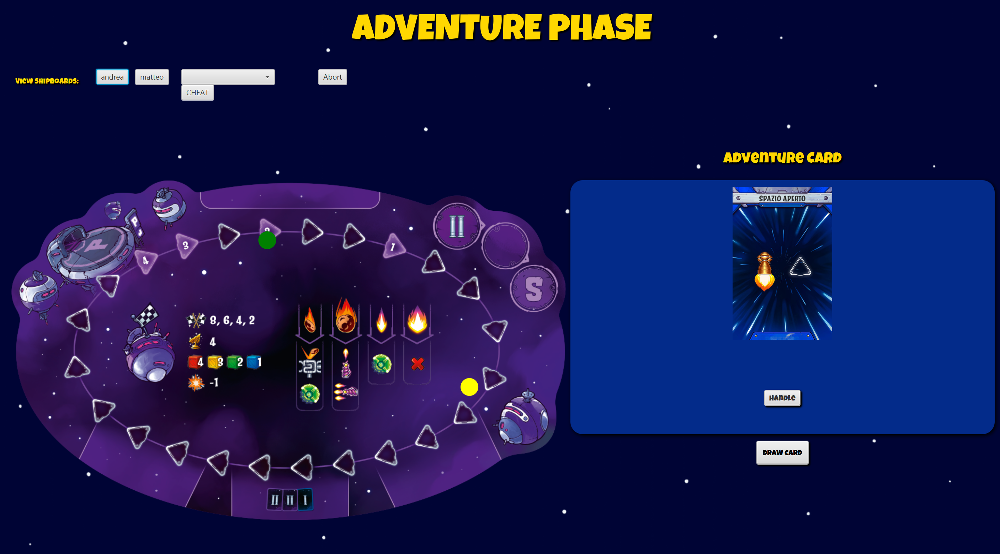
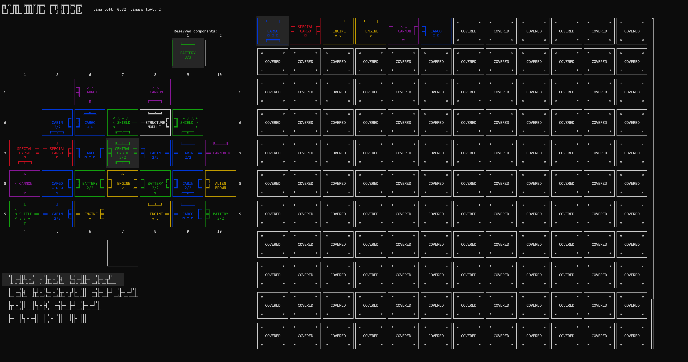
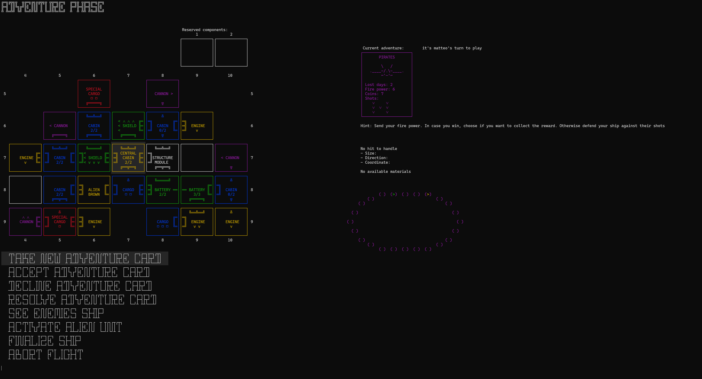
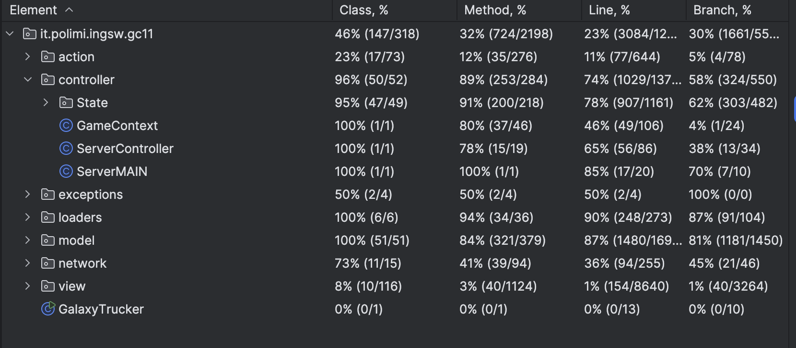

# Galaxy Trucker — Software Engineering Project

**Galaxy Trucker** is a software project inspired by the board game of the same name, developed as part of the *Software Engineering* course at Politecnico di Milano. While it replicates the game's mechanics, the main focus was designing and implementing a modular, testable, and networked application in Java.

Final grade: **30/30**.

---

## Technologies & Architecture

### Language & Tooling
- Java 22
- JavaFX for the graphical user interface (GUI)
- JLine for the text-based interface (TUI)
- Maven for dependency and build management
- JUnit for unit and integration testing

### Architecture
- MVC (Model-View-Controller) pattern with a thin client structure
- Clear separation of responsibilities:
  - The **Model** is shared between client and server
  - The **Controller** runs on the server
  - The **View** runs on the client (GUI and TUI are fully interchangeable)

### Networking
- Dual implementation of client-server communication:
  - RMI (Remote Method Invocation)
  - Custom TCP Socket protocol
- The client can dynamically choose the communication protocol at runtime, without affecting game logic or experience

---

## GUI — JavaFX
- Fully interactive visual interface
- Drag & drop support for spaceship construction
- Visual feedback and animations during flight

example building phase:

example adventure phase:

---

## TUI — JLine
- Responsive terminal interface
- Keyboard-based navigation using WASD and enter for everything
- Suitable for headless environments (e.g., SSH sessions)

example building phase:

example adventure phase:

---

## ✅ Testing & Code Quality

- Complete test suite, including unit tests, integration tests, and networking tests
- Modular design allows mocking and isolated testing
- Build and test automation handled by Maven and the Surefire plugin

---

## Key Features

- Multiplayer support (up to 4 players) over local network
- Capable of handling multiple matches at the same time
- Dynamic spaceship construction with real constraints
- Automatic event resolution during the flight phase
- Real-time state synchronization between server and clients
- Support for both standard and advanced game modes

---

## How to Run the Project

**Requirements:** Java 22+

### Build the project

Use Maven to build the entire project and generate runnable JAR files.  
From the root directory, run the Maven `clean install` goal.

After the build, you will find a single JAR for both server and client.

### Running the Server

To start the server, run the JAR file with the `-s` flag.  
By default, the server runs on `localhost` and listens on RMI port `1099` and Socket port `1234`.

You can also specify ports using the following arguments:  
`-s [RMI port] [Socket port]`

**Example:**  
To run the server on RMI port `5000` and Socket port `6000`, use:  
`-s 5000 6000`

### Running the Client

By default, running the JAR launches the **JavaFX graphical interface (GUI)**.  
To run the **text-based interface (TUI)** instead, add the `-cli` flag.

You can also specify the server's IP and port if needed:  
`[-cli] [host] [port]`

**Examples:**
- To run the GUI and connect to default server (localhost:1099):  
  `no arguments required`
- To run the TUI and connect to a custom server:  
  `-cli 192.168.1.10 5000`

---

At startup, the client will ask the user to choose between **RMI** and **Socket** as the communication protocol.

---

## Authors

- [Andrea Santarsiero](https://github.com/AndreaSantarsiero)  
- [Luca Sartori](https://github.com/Luca-Sartori)  
- [Andrea Pianini](https://github.com/AndreaPianini)  
- [Lorenzo Stani](https://github.com/lorenzostani)

---

## 📄 License

This project is licensed under the **GPL-3.0 License**.
